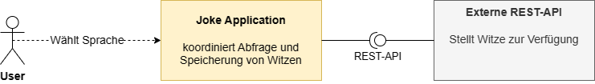
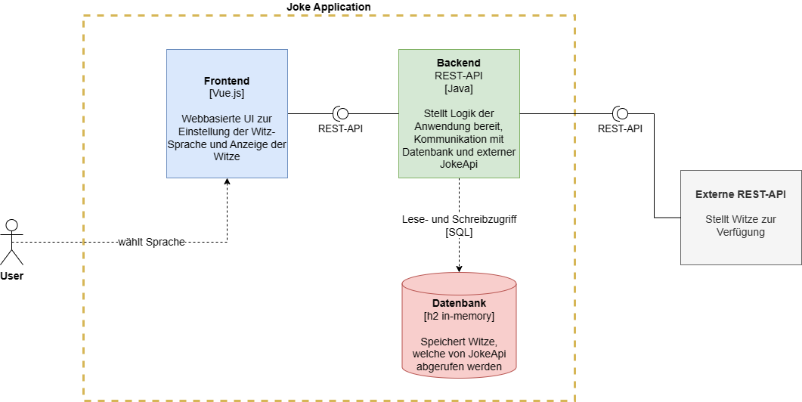
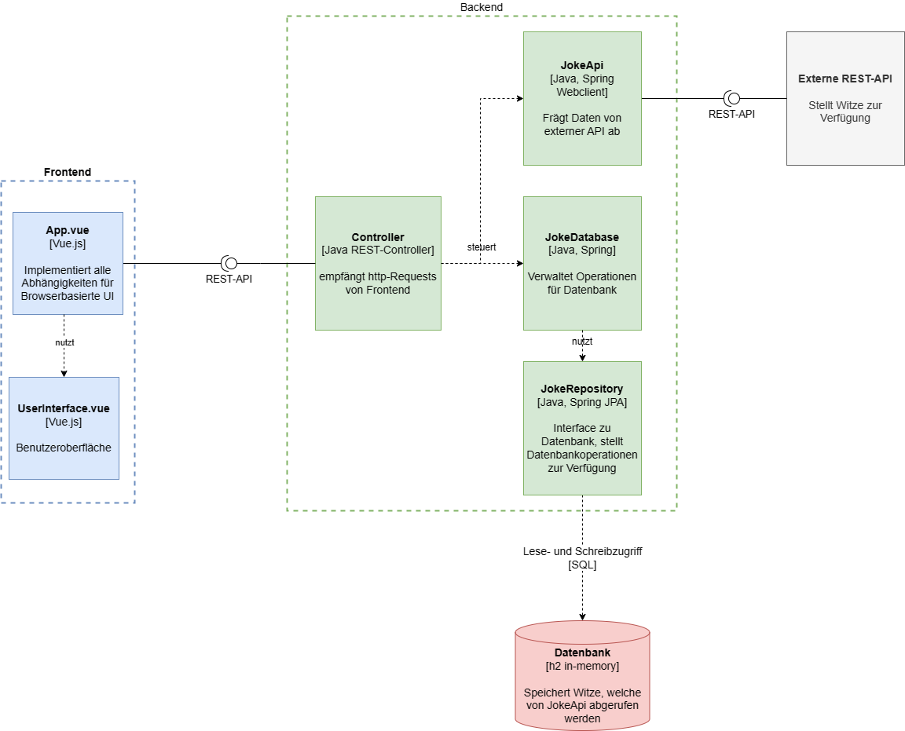
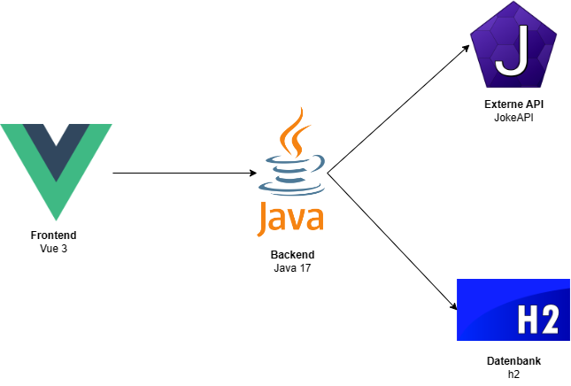

# Joke Application
>Simple Webanwendung zur Ausgabe von Programmierer-Witzen

   

 

# Projektdokumentation
>Dokumentation zum Projekt im Fach "Software-Qualitätssicherung" im Masterstudiengang Informatik an der TH Rosenheim.
> 
> Sommersemester 2023 - Tobias Kirschner
> 
> Die Struktur der Projektdokumentation orientiert sich an dem offiziellen [Arc42-Template](https://docs.arc42.org/home/)

**Allgemeine Informationen zur lokalen Handhabung der Anwendung**

Starte Backend (Java 17, Springboot 3):
- Build with Maven
- Maven Goal: .\mvn spring-boot:run
- Erreichbar unter: http://localhost:8080/

Starte Frontend (Vue 3):
- Laufzeitumgebung Node.js
- Node Goal: .\npm run dev
- Erreichbar unter: http://localhost:5173/

Datenbank (H2):
- Wird mit Starten des Backends automatisch hochgefahren
- Erreichbar unter: http://localhost:8080/h2-console/
- JDBC URL: jdbc:h2:mem:testdb
- User Name: sa
- Passwort: *kein Passwort*

# 1 Einführung und Ziele
Die Joke Application bietet ein einfaches Userinterface zur Anzeige von Programmierer-Witzen. Beim Starten der Anwendung werden 10 Witze für jede einstellbare Sprache von einer öffentlichen [JokeApi](https://v2.jokeapi.dev/) geladen und in einer SQL-Datenbank abgespeichert. Durch ein Dropdown-Menü kann die bevorzugte Sprache des Witzes eingestellt werden. Mit klicken auf den "Submit"-Button wird ein Witz in der eingestellten Sprache aus der Datenbank geladen und dem User angezeigt. Erreicht die Datenbank ein kritisches Minimum an Objekten, werden neue Witze von der JokeApi nachgeladen. Hierdurch soll sichergestellt werden, dass dem User stets ein Mindestmaß an Witzen zur Verfügung steht, sollte zeitweise keine Verbindung zur JokeApi möglich sein.

## Aufgabenstellung
Die wesentliche Aufgabenstellung umfasst das Entwickeln und Absichern einer simplen Webanwendung mit rudimentären Interaktionsmöglichkeiten für den User. Die funktionalen Anforderungen hierbei sind:
- Webbasierte Benutzeroberfläche mit Möglichkeit zur Interaktion
- Rest Api Schnittstelle zur Kommunikation mit dem Backend
- Anbindung einer 3rd-Party Api zum Laden von Daten aus dem Netz
- Integration einer Datenbank zur Speicherung von Daten

## Qualitätsziele
Ziel ist es die Anwendung softwaretechnisch weitgreifend abzusichern. Dazu gehören unter anderem:
- Sorgfältige Auswahl der verwendeten Technologien und Frameworks
- Passende Entscheidungen in Bezug auf die Architektur
- Maintainability
- Usability
- Security
- Funktional Safety
- Performance

Die detaillierte Ausarbeitung und Umsetzung der Qualitätsziele werden in [Kapitel 10](#10-Qualität) ausgeführt.

## Stakeholder
Relevante Stakeholder sind die Anwender der Joke Application, die Studenten und der Dozent der Vorlesung "Software-Qualitätssicherung" sowie der Betreiber der angebundenen [JokeApi](https://v2.jokeapi.dev/).

# 2 Randbedingungen

## Technische Randbedingungen vom Dozenten zur Projektstruktur
- Frontend mit Möglichkeit der Userinteraktion
- Backend in Java oder .NET
- Öffentliche externe REST-API
- Datenbank

## Organisatorische Randbedingungen
- Zeitrahmen: Fixer Abgabetermin für das Projekt am 03.07.2023
- Ressourcen: Der finanzielle Aufwand sowie benötigten technischen Ressourcen müssen vom Studenten tragbar sein
- Qualitätssicherung: Einhaltung der Mindestanforderung an qualitätssichernden Maßnahmen

# 3 Kontextabgrenzung
Die Kontextabgrenzung wird im Folgenden in Form von Diagrammen ausgeführt. Die Visualisierungen orientieren sich am [C4 Modell](https://c4model.com/).

## Level 1 (Context)
Das folgende Kontextdiagramm das System mit seinen logischen Schnittstellen nach Außen im Gesamtbild.

## Level 2 (Containers)
Das Container-Diagramm zeigt die übergeordnete Struktur der Softwarearchitektur und wie Verantwortlichkeiten darauf verteilt sind. Es zeigt auch die wesentlichen Technologieentscheidungen und wie die Container miteinander kommunizieren.

## Level 3 (Components)
Das Komponentendiagramm zeigt, wie ein Container aus einer Reihe von "Komponenten" besteht, welche Aufgaben jede dieser Komponenten hat und welche technologischen bzw. Implementierungsdetails damit verbunden sind.

# 4 Lösungsstrategie

Verwendeter Technologie-Stack:
- Frontend: Vue 3
- Backend: Java 17
- Externe REST-API: [JokeAPI](https://v2.jokeapi.dev/)
- Datenbank: H2

Folgende Faktoren haben die Wahl dieses Technologie-Stacks beeinflusst:

**Frontend: Vue 3**
Die Verwendung von Vue 3 als Frontend-Technologie bietet mehrere Vorteile. Vue ist ein modernes JavaScript-Framework, das eine effiziente und flexible Entwicklung von interaktiven Benutzeroberflächen ermöglicht. Es bietet eine komponentenbasierte Architektur, die die Wiederverwendbarkeit von Code fördert und die Entwicklung und Wartung von Frontend-Anwendungen erleichtert. Das Frontend muss viele unterschiedliche Komponenten für eine ordentliche Darstellung der Weboberfläche vereinen. Es ist ein Framework nötig, das html, css, JavaScript sowie http unterstützt und leicht zusammen anwendbar macht.

**Backend: Java 17**
Die Verwendung von Java 17 als Backend-Technologie bietet eine solide Grundlage für die Entwicklung von robusten und skalierbaren Anwendungen. Java ist eine weit verbreitete Programmiersprache mit einer großen Community und reichhaltigen Ökosystem von Bibliotheken und Frameworks. Es bietet starke Typisierung, Sicherheit und Stabilität.

Die Kombination des Stacks mit dem Spring Boot Framework repräsentiert eine häufig verwendete Technologie-Kombination, die sich in Bezug auf Sicherheitskriterien und integrierte nützliche Funktionen bewährt hat.

**Externe REST-API: JokeAPI**
Die Nutzung einer externen REST-API war vorgegeben. 
Die JokeAPI bietet den Vorteil, dass bereits vorhandene Witze aus einer vertrauenswürdigen Quelle abgerufen werden können, anstatt eigene Witze erstellen oder verwalten zu müssen. Dies spart Zeit und Ressourcen bei der Entwicklung und Wartung einer eigenen Witze-Datenbank. JokeAPI bietet eine breite Auswahl an Daten und Funktionen, die in die Anwendung integriert werden können.

**Datenbank: H2**
Die Verwendung einer eingebetteten Datenbank wie H2 bietet mehrere Vorteile. Eine eingebettete Datenbank erfordert keine separate Installation und Konfiguration, da sie in die Anwendung integriert ist. Dies erleichtert die Bereitstellung und den Betrieb der Anwendung. H2 ist eine relationale Datenbank, die in Java entwickelt wurde und eine gute Performance und Skalierbarkeit bietet. Sie eignet sich gut für kleinere Anwendungen, in denen keine hochgradig verteilte oder hochvolumige Datenverarbeitung erforderlich ist.

# 5 Bausteinsicht
Die allgemeine Bausteinsicht kann den Diagrammen in [Kapitel 3](#3-kontextabgrenzung) entnommen werden. Da sich die Komplexität der Anwendung in Grenzen hält, wird hier nicht näher drauf eingegangen.

# 6 Laufzeitsicht (Runtime)
Im Folgenden wird das Zusammenspiel der einzelnen Komponenten während der Laufzeit erläutert:

1. Benutzer startet die Anwendung.
2. Das Backend sendet mehrere GET-Requests an die externe API und speichert für jede auswählbare Sprache 10 Witze in die SQL-Datenbank.
3. Sobald der User über ein Dropdown-Menü eine Sprache ausgewählt hat und auf den "Submit"-Button klickt überprüft das Frontend, ob eine valide Eingabe getätigt wurde. Ist dies der Fall, wird ein POST-Request mit der entsprechenden Nutzereingabe an den REST-Controller im Backend gesendet.
4. Der Controller überprüft nun zunächst, ob von jeder Sprache noch genügend Witze in der Datenbank vorhanden sind. Ist dies der Fall, wird der erste Witz, der mit der vom User ausgewählten Sprache übereinstimmt aus der Datenbank geladen und an das Frontend zurückgegeben, wo er dann entsprechend angezeigt wird. Anschließend wird der Witz aus der Datenbank entfernt.
5. Bemerkt der Controller beim Ausführen des eben genannten Schritts, dass sich von einer Sprache nur noch weniger als 5 Witze befinden, werden GET-Requests an die externe API gesendet, um die Datenbank wieder mit Witzen der entsprechenden Sprache zu befüllen.

# 7 Verteilungssicht (Deployment)
Die Anwendung nutzt einen Webserver für das Frontend und einen Applikationsserver für das Backend als Ausführungsumgebung. Die verwendete H2 Datenbank ist eine In-Memory-Datenbank und wird mit Ausführung des Applikationsservers gestartet.
Für die Anwendung besteht die Möglichkeit, alle Komponenten sowie in einer dedizierten Virtualisierungsumgebung (On-Premise) als auch containerisiert in der Cloud bereitzustellen.

Während der Entwicklungs- und Testphase wurde die Anwendung lokal deployt und ausgeführt. Bei größeren und komplexeren Anwendungen ist es üblich, verschiedene Umgebungen wie Development, Test, Staging und Production einzurichten. Im Rahmen dieses Projekts wurde aufgrund der geringen Komplexität der Anwendung auf eine solche Unterteilung verzichtet.

# 8 Querschnittsicht
## Fachliche Konzepte:
Die Anwendung dient dazu dem Benutzer Programmierer-Witze, je nach Eingabe, auf Deutsch oder Englisch anzuzeigen. Dazu gehört die Integration einer externen REST-API (JokeAPI), um Zugriff auf eine Vielzahl von Witzen zu haben.

## User Experience (UX):
Das Frontend wurde entworfen, um eine benutzerfreundliche Oberfläche mit einem Dropdown-Menü, einem Button und einem Anzeigefeld bereitzustellen. Eine ansprechende und intuitive Benutzeroberfläche trägt dazu bei, dass die Anwendung einfach und angenehm zu bedienen ist. Zudem ist die Oberfläche so aufgebaut, dass im Normalfall keine falsche Eingabe getätigt werden.

Das Cachen von Witzen in der integrierten Datenbank ermöglicht es beim Ausfall der externen API dennoch einen gewissen Vorrat an Ergebnissen anzeigen zu können. Hierdurch soll eine möglichst positive User Experience an den Anwender herangetragen werden.

## Sicherheitskonzepte
Die Anwendung wurde über alle Komponenten hinweg verschiedensten Tests unterzogen. Diese werden in [Kapitel 11](#11-qualittssichernde-manahmen-und-testmanagement) detailliert erläutert.

## Architektur- und Entwurfsmuster:
Die Anwendung verwendet das Model-View-Controller Modell, um eine klare Trennung von Verantwortlichkeiten und eine modulare Struktur zu erreichen. Das Frontend (Vue 3) und das Backend (Java 17) sind voneinander unabhängig und kommunizieren über definierte Schnittstellen. Das gilt ebenso für die externe API und die angebundene Datenbank. Dies ermöglicht eine leichtere Wartung, Erweiterbarkeit und Testbarkeit der Anwendung.

## Under-The-Hood:
Aufgrund des modularen Aufbaus ist eine Skalierung der Anwendung jederzeit möglich. Zudem wurden die einzelnen Services und Klassen so geschrieben, dass die Anwendung leicht erweitert werden kann, wie beispielsweise das Hinzufügen weiterer Sprachen oder Themengebiete.

Ein integrierter Logger dokumentiert detailliert in einem entsprechenden logging-file, falls Probleme mit der externen API oder der Datenbank auftreten. Hierdurch kann stets nachgeprüft werden, was der Grund für einen eventuellen Ausfall der Anwendung war.

## Entwicklungskonzepte:
Bei der Entwicklung der Anwendung wurden bewährte Softwareentwicklungsmethoden wie die Verwendung von Versionskontrolle (GitHub), automatisierte Tests, Continuous Integration und Continuous Deployment (CI/CD) angewendet. Dadurch wird eine hohe Codequalität, Fehlererkennung und eine effiziente Bereitstellung der Anwendung sichergestellt.

# 9 Architekturentscheidungen
Dokumentation der wichtigsten Architekturentscheidungen nach den architecture desicion records (ADR):

|    |Beschreibung|
|---        |---         |
|Titel   |Architektur-Modell Backend   |
|Status   |Akzeptiert  |
|Kontext   |Die Anwendung soll ein Zusammenspiel aus vielen verschiedenen Komponenten sein. Frontend, Backend, Externe API, Datenbank.    |
|Entscheidung   |Model-View-Controller (MVC) |
|Konsequenzen   |Trennung von Daten, Logik und Darstellung verbessert Wartbarkeit, Wiederverwendbarkeit und parallelisierte Entwicklung. Umfangreiche Abhängigkeiten zwischen den Komponenten führen jedoch auch zu erhöhter Komplexität. Eine nachträgliche Änderung des Schemas wäre äußerst umständlich.|

|    |Beschreibung|
|---        |---         |
|Titel   |Frontend Server   |
|Status   |Akzeptiert  |
|Kontext   |Bewährte Technologie nötig, die das gewählte Frontend-Framework Vue.js unterstützt    |
|Entscheidung   |Vite |
|Konsequenzen   |Schnelle Entwicklung durch Hot-Module-Replacement-Funktion sowie einfache Konfiguration. Die Entscheidung bringt jedoch auch mit sich, dass ältere Browser lediglich limitiert unterstützt werden und es nur eine kleine Community im Vergleich zu etablierteren Frontend-Servern gibt.|

|    |Beschreibung|
|---        |---         |
|Titel   |Internetkommunikation   |
|Status   |Akzeptiert  |
|Kontext   |Weitläufig verbreitete und unterstützte Technologie für die Kommunikation über das Netz notwendig, um funktionale Sicherheit garantieren zu können.    |
|Entscheidung   |REST |
|Konsequenzen   |Eines der am weitesten verbreiteten Kommunikationsschnittstellen und somit von vielen Entwicklern beherrscht. Benutzt einfache und standardisierte Prinzipien wie HTTP und verwendet verbreitete Dateiformate wie JSON, was die Integration in verschiedene Komponenten erleichtert. Dennoch ist REST relativ unflexibel, da es lediglich auf das Lesen, Aktualisieren, Erstellen und Löschen von Ressourcen beschränkt ist. Für den Umfang dieser Anwendung jedoch völlig ausreichend.|

|    |Beschreibung|
|---        |---         |
|Titel   |Art der Datenbank   |
|Status   |Akzeptiert  |
|Kontext   |Wahl zwischen SQL- und NoSQL-basiertem Datenbanktyp. Datenbank wird lediglich als temporärer Zwischenspeicher von Strings benutzt und muss keine großen Datenmengen über längere Zeit verwalten.  |
|Entscheidung   |SQL-basierte DB |
|Konsequenzen   |SQL ist eine umfangreiche und leistungsstarke Datenbanksprache, welche es erlaubt die Daten effizient abzurufen. Durch robuste Mechanismen zur Datenkonsistenz und Integrität können die Witze korrekt und wie gewünscht abgerufen und gespeichert werden. SQL-Datenbanken können in Bezug auf horizontale Skalierbarkeit und das Handhaben großer Datenmengen möglicherweise nicht so flexibel sein. Da die hier entwickelte Anwendung in dieser Ausführung jedoch nur sehr geringe Datenmengen verarbeitet ist dieses Problem als unkritisch zu betrachten. |

# 10 Qualität
Im Folgenden werden die wichtigsten Qualitätsmerkmale erläutert, die bei der Entwicklung der Anwendung stets berücksichtigt wurden:

- **Funktionalität:** Die Software erfüllt alle funktionalen Anforderungen und bietet die erwarteten Funktionen und Dienste. >> Sichergestellt durch Integrations- und Unittests.

- **Zuverlässigkeit:** Die Software ist stabil, robust und zuverlässig. Sie erfüllt die festgelegten Anforderungen und führt ihre Aufgaben fehlerfrei aus. >> Last- und End-to-End Tests.

- **Benutzbarkeit:** Die Software ist benutzerfreundlich und leicht verständlich. Sie bietet eine intuitive Benutzeroberfläche und ermöglicht eine effiziente Interaktion mit den Benutzern. >> Sichergestellt durch intuitives GUI-Layout.

- **Wartbarkeit:** Die Software ist gut strukturiert, modular aufgebaut und leicht wartbar. Änderungen und Erweiterungen können einfach implementiert werden, ohne die Stabilität des Systems zu beeinträchtigen. Ein implementierter Logger erleichtert Fehleranalysen. Statische Codeanalyse durch Sonarcloud und Linter-Verfahren garantieren die Einhaltung von Code-Konventionen.

- **Sicherheit:** Benutzeroberfläche so gestaltet, dass fehlerhafte Eingaben nicht möglich sind. Stetige Codeanalyse und automatisierte Testdurchläufe durch GitHub CI-Pipeline. >> Anwendung wird regelmäßig auf Sicherheitslücken und veraltete Dependencies überprüft.

- **Anpassbarkeit:** Die Software kann an spezifische Anforderungen und Konfigurationen angepasst werden. Die verwendeten Klassen und Komponenten sind so strukturiert, dass eine flexible Konfiguration auch im Nachhinein gewährleistet werden kann.

- **Testbarkeit:** Die Software ist gut testbar und ermöglicht eine effektive Durchführung von automatisierten Tests. Sie unterstützt Testaktivitäten, um die Qualität und Funktionalität der Software regelmäßig zu überprüfen. >> CI-Pipeline.

- **Performanz:** Die Software kann bei Bedarf problemlos skaliert werden, um wachsenden Anforderungen und steigenden Benutzerzahlen gerecht zu werden. >> Überprüft durch Last- und Stresstests.

# 11 Qualitätssichernde Maßnahmen und Testmanagement
Um die im vorangegangen Qualitätsmerkmale garantieren zu können wurden entsprechende Tests integriert. Diese können lokal ausgeführt werden, sind jedoch ebenso automatisiert in die GitHub CI-Pipeline integriert. Die entsprechenden Workflows können in dem Ordner `.github\workflows` eingesehen werden.

## Unittests Backend
- **Frameworks:** JUnit, Mockito
- **Ordner:** `src/test/java/com/sqs/jokeapplication`
- **Vorgehen:** Überprüfung aller relevanten Methoden auf korrekte Funktionalität. Hierbei wurden Komponenten Dritter (z.B. externe API, Datenbank etc.) gemockt, um die Tests unabhängig ausführen zu können

## Integrationtests
- **Framework:** JUnit
- **Ordner:** `src/test/java/com/sqs/jokeapplication`
- **Vorgehen:** Überprüfung des korrekten Zusammenspiels zwischen den einzelnen Komponenten. Datenbankoperationen, API-Requests

## Unittests Frontend
- **Framework:** Vitest
- **Testfile:** `src/main/Frontend/joke-application-vue-frontend/src/UserInterfaceUnit.test.js`
- **Vorgehen:** Überprüfung der Benutzereingabe

## Statische Codeanalyse
- **Tool:** Sonarcloud, GitHub super-linter
- **Testskript:** `.github\workflows\build-and-test.yml`
- **Vorgehen:** Mit dem GitHub super-linter wird der Code bei jedem Push- oder Pullrequest auf allgemeine Code-Konventionen überprüft. Zudem wird in der CI-Pipeline eine Verbindung zu Sonarcloud hergestellt, um automatisch eine statische Codeanalyse zu triggern. Die Ergebnisse können auf [Sonarcloud](https://sonarcloud.io/project/overview?id=t-kirschner_joke-application) eingesehen werden. Zudem sind die wichtigsten Informationen in den Sonarcloud-Badges am Anfang dieser Datei eingebettet.

## Securitytests
- **Tools:** OWASP Dependency Check, Dependa-bot
- **Testskript:** `.github\workflows\dependency-check.yml`
- **Vorgehen:** Der OWASP Dependency Check wurde in einen von den restlichen Tests separierten Workflow eingebettet. Dieser wird nicht nur bei Push- oder Pullrequests, sondern auch wöchentlich automatisch ausgeführt. Hierdurch wird sichergestellt, dass auch nach längerem Stillstand des Repositorys (z.B. Entwicklungspause) trotzdem noch regelmäßig nach Sicherheitslücken in den Dependencies gesucht wird. Der erstellte Bericht kann nach Beendigung eines Tests im GitHub unter dem entsprechenden Workflow-Run unter *Artifacts* eingesehen werden. Zusätzlich wurde der Dependa-bot auf GitHub aktiviert, um stets Benachrichtigungen über veraltete Dependencies zu erhalten.

## Lasttests
- **Framework:** k6
- **Ordner:** `src/test/performance`
- **Vorgehen:**
    - *Load-Test:* Überprüfung des Systemverhaltens unter regulärer Last. (ca. 50 User innerhalb von 5 Minuten)
    - *Stress-Test:* Überprüfung des Systemverhaltens unter extremer Belastung. (ca. 1000 User innerhalb von 15 Minuten)
    - Auch diese Tests wurden in die CI-Pipeline in `.github\workflows\build-and-test.yml` integriert und automatisiert.

## End-to-End Tests
- **Framework:** Cypress
- **Testfile:** `src/main/Frontend/joke-application-vue-frontend/cypress/e2e/application_page.cy.js`
- **Vorgehen:** Um die Anwendung abschließend in ihrer Ganzheit auf ihre Funktionalität abzutesten, wurde ein End-to-End Test geschrieben und ebenfalls in die CI-Pipeline integriert. Hierfür wird die komplette Anwendung (Backend, Frontend, Datenbank) gestartet und die Weboberfläche über Cypress aufgerufen. Anschließend werden alle möglichen Eingabeoptionen des Dropdown-Menüs sowie das Klicken auf den Button simuliert. Dabei wird die laufende Anwendung mit den zugehörigen HTTP-Requests, logischen Abläufen, Datenbankoperationen und GUI-Verhalten im Gesamten abgetestet. Die Ergebnisse können nach der Ausführung (z.B. in der CI-Pipeline) in der Konsolenausgabe eingesehen werden.

## Fehlerbehandlung und Logging
Allgemein wurde darauf geachtet, dass jegliche Art von potenziell auftretenden Fehlern (z.B. Internetausfall, Datenbank down, externe API down, etc.) mit entsprechender Fehlerbehandlung abgefangen werden. Sollten Fehler auftreten, die dazu führen, dass dem User keine Witze mehr angezeigt werden, so wird ihm eine entsprechende Nachricht angezeigt mit Informationen zur aktuellen Unfunktionalität der Anwendung oder mit Tipps zur Fehlerbehebung (z.B. Internetverbindung überprüfen).

Zur sauberen Dokumentation wurde ein Logger implementiert, welcher den Trace von aufgetretenen Fehlern in einer logfile abspeichert. Sollte noch kein logfile bestehen wird dies automatisch beim Auftreten eines Fehlers erstellt. Dies kann im Root-Verzeichnis unter `logfile.log` eingesehen werden.

# 11 Risiken
Abschließend werden zu berücksichtigende potenzielle Risiken aufgeführt:

- **Abhängigkeit von externer API:** Da die Anwendung von einer externen REST-API abhängig ist, besteht das Risiko von Ausfallzeiten oder Änderungen an der API, die sich auf die Funktionalität der Anwendung auswirken können. Es ist wichtig, diese Abhängigkeit zu überwachen und mögliche Auswirkungen zu bewerten.

- **Skalierbarkeit:** Da eine In-Memory-Datenbank Datenbank verwendet wird, könnte es bei zunehmender Datenmengen oder erhöhten Zugriffszahlen zu Performance- oder Stabilitätsproblemen kommen. Es ist wichtig, die Datenbankleistung zu überwachen und mögliche Engpässe oder Bottlenecks zu identifizieren.

- **Security-Hotspot:** Sonarcloud hat die Implementierung des Logging Managers als kritisch angesehen, da anwendungsinterne Fehlermeldungen in einer "ungeschützten" Datei abgelegt werden. Da die Anwendung im aktuellen Entwicklungsstand jedoch keine sensiblen Daten loggt, wurde die Warnung als unproblematisch eingestuft. Sollte sich dies in Zukunft (z.B. bei entsprechender Weiterentwicklung der Anwendung) ändern, dann sollte eine Verschlüsselung des Logging-Prozesses in Erwägung gezogen werden.